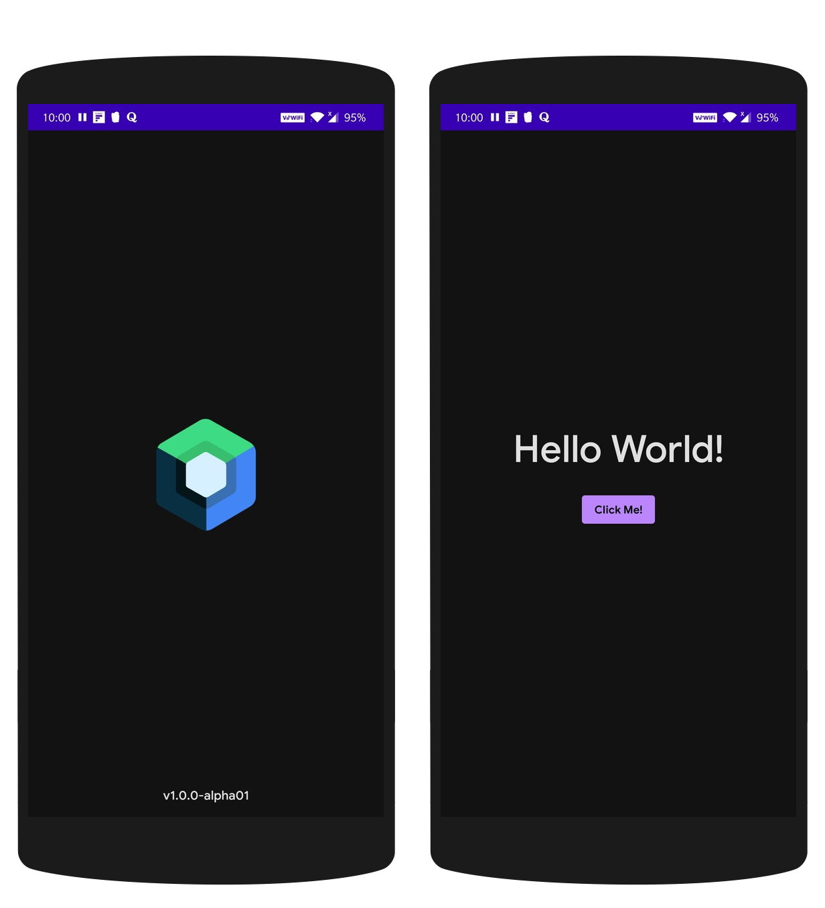
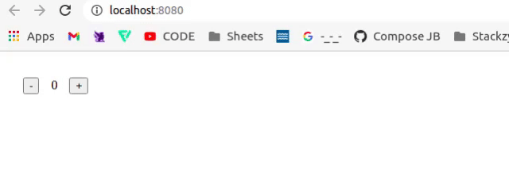
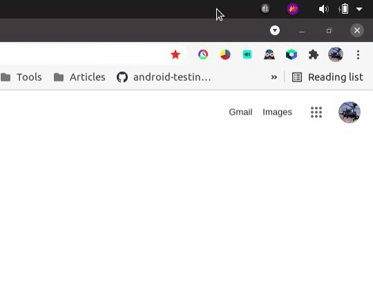

# 💻 create-compose-app


<a href="https://twitter.com/theapache64" target="_blank">

</a>

> A tool that gives you a massive head start when building Compose based apps. It saves you from time-consuming setup and configuration


## 🛠 Installation

```shell
~$ sudo npm install -g create-compose-app
```

## ⌨️ Usage

```shell script
~$ create-compose-app
Choose platform
1) Android
2) Desktop
3) Web
4) Chrome extension
```

### ✨ Demo

#### Android ([see template](https://github.com/theapache64/compose-android-template))



- MVVM
- Hilt
- Compose
- Navigation
- Logger
- Typography (with GoogleSans)


#### Desktop ([see template](https://github.com/theapache64/compose-desktop-template))


- Architecture (MVVM) with Android-ish structure (SingleActivity)
- Dependency Injection (Dagger2)
- Navigation/Routing (Decompose)
- Launcher Icons (for all platforms)
- A separate data module
- Testing (both unit tests and UI tests)
- Theme
- Logging (Arbor)
- Font (GoogleSans)

#### Web  ([see template](https://github.com/theapache64/compose-web-template))



- A basic web counter example

#### Chrome extension ([see template](https://github.com/theapache64/compose-chrome-extension-template))



- A simple popup window


## ✍️ Author

👤 **theapache64**

* Twitter: <a href="https://twitter.com/theapache64" target="_blank">@theapache64</a>
* Email: theapache64@gmail.com

Feel free to ping me 😉

## 🤝 Contributing

Contributions are what make the open source community such an amazing place to be learn, inspire, and create. Any
contributions you make are **greatly appreciated**.

1. Open an issue first to discuss what you would like to change.
1. Fork the Project
1. Create your feature branch (`git checkout -b feature/amazing-feature`)
1. Commit your changes (`git commit -m 'Add some amazing feature'`)
1. Push to the branch (`git push origin feature/amazing-feature`)
1. Open a pull request

Please make sure to update tests as appropriate.

## ❤ Show your support

Give a ⭐️ if this project helped you!

<a href="https://www.patreon.com/theapache64">
  
</a>

<a href="https://www.buymeacoffee.com/theapache64" target="_blank">
    
</a>

## 📝 License

```
Copyright © 2021 - theapache64

Licensed under the Apache License, Version 2.0 (the "License");
you may not use this file except in compliance with the License.
You may obtain a copy of the License at

   http://www.apache.org/licenses/LICENSE-2.0

Unless required by applicable law or agreed to in writing, software
distributed under the License is distributed on an "AS IS" BASIS,
WITHOUT WARRANTIES OR CONDITIONS OF ANY KIND, either express or implied.
See the License for the specific language governing permissions and
limitations under the License.
```

_This README was generated by [readgen](https://github.com/theapache64/readgen)_ ❤